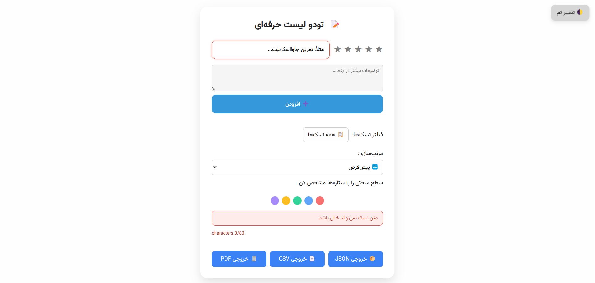
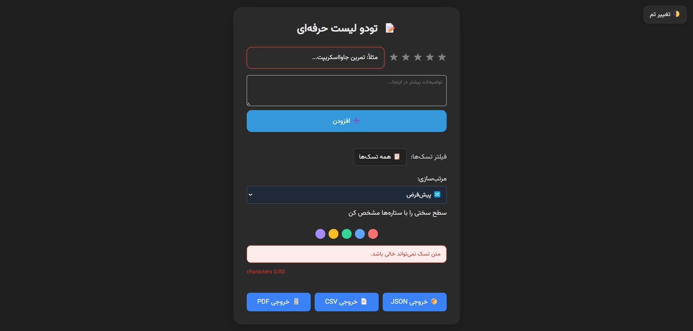

# 📝 To-Do List Web App

A simple and elegant To-Do List application with support for dark/light themes, task difficulty using stars, responsive design, and custom scrollbars.

## ✨ Features

- Add tasks with difficulty level (star rating)
- Fully responsive for mobile and desktop
- Light/Dark theme toggle
- Custom styled scrollbar matching the theme
- Clean and modern UI
- CSS Variables for easy theming

## ⚙️ Built With

- HTML5
- CSS3 (Media Queries, Variables)
- JavaScript (Vanilla JS)
- Git for version control

## 📸 Preview

**Light Theme Preview:**  

**Dark Theme Preview:**  

## 🚀 Getting Started

Simply open the `index.html` file in your browser, or run with Live Server in VSCode.

## 📅 Future Improvements

- LocalStorage integration to save tasks
- Ability to edit/delete tasks
- Filtering tasks by difficulty
- Remaining task counter

## 👨‍💻 Developed By

Your Name – [Your GitHub Profile URL]
